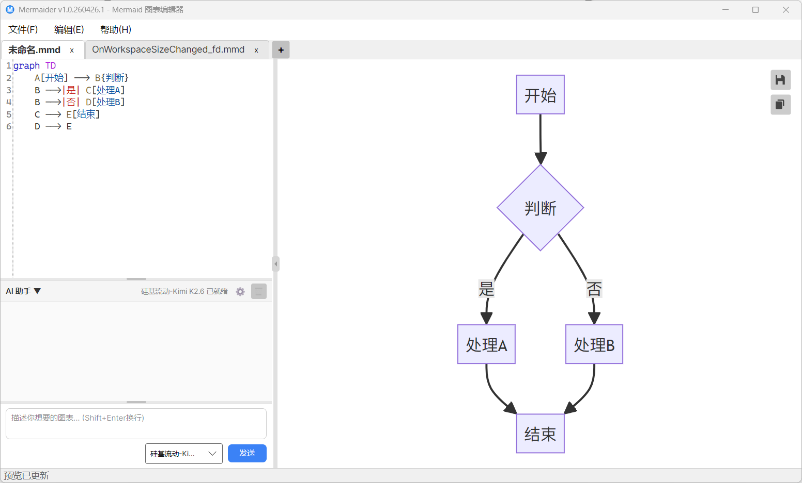
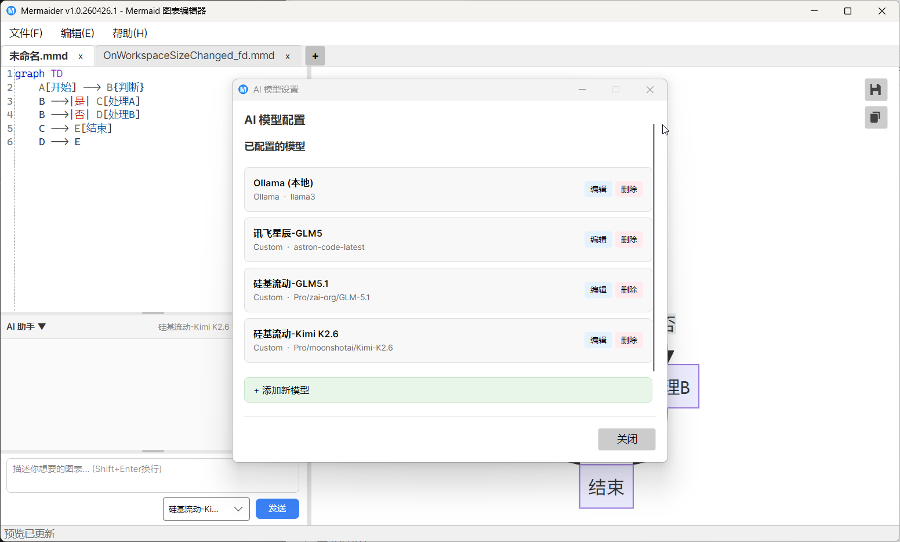

# Mermaider - Mermaid 图表编辑器

一个基于 C# Avalonia 构建的本地 Mermaid 图表编辑器，支持代码编辑、语法高亮、实时预览、缩放拖拽、语法检测、图片导出与复制，集成 AI 助手通过自然语言生成图表，数据本地渲染不上传。

## 界面截图





## 功能特性

### 代码编辑
- **语法高亮** - Mermaid 语法高亮与行号显示
- **多标签页** - 支持多文件独立编辑，自动切换
- **智能防抖** - 输入后自动延迟 350ms 渲染，避免频繁刷新

### 实时预览
- **JavaScript 注入更新** - 首次通过 WebView 加载 HTML，后续使用 `ExecuteScriptAsync` 注入 JS 直接更新，无文件导航延迟
- **渲染函数暴露** - 全局 `renderDiagram(code)` 函数可被外部调用，支持零延迟更新
- **拖拽平移** - 按住鼠标左键拖拽移动图表
- **滚轮缩放** - 可缩放 0.2x ~ 6x
- **双击适应** - 双击预览区自动适配视口
- **编辑器切换** - 隐藏/显示编辑器获得全屏预览

### 图片操作
- **保存图片** - 导出高清 PNG 图片（3x 缩放）
- **复制图片** - 将图表复制到系统剪贴板

### 文件操作
- 新建 / 打开 / 保存 Mermaid 文件（.mmd / .mermaid）
- 支持命令行参数打开文件
- 最近文件记录（最多 10 个）
- 关闭未保存标签时弹出保存确认
- 关闭程序时检测未保存修改

### AI 助手
- **自然语言生成** - 描述你想要的图表，AI 自动生成 Mermaid 代码
- **多模型支持** - OpenAI、Azure OpenAI、Ollama、自定义 API
- **一键应用** - AI 生成的代码可直接应用到编辑器，支持回退
- **对话历史** - 持久化保存，支持连续交互
- **可配置参数** - Temperature、MaxTokens 等参数可调
- **消息可选中** - 对话消息文字（含代码）可选中复制
- **多行输入** - 输入框支持多行文字，Shift+Enter 换行
- **可拖拽分隔** - 对话历史与输入区之间可拖拽调整高度

### 界面特性
- **拖拽分隔条** - 编辑器与预览区比例可拖拽调节
- **内置切换按钮** - 分隔条中点击隐藏/显示编辑器
- **Fluent 主题** - 现代化界面风格
- **自动保存布局** - 编辑器比例、缩放级别、AI 面板状态等设置自动保存

### 技术细节
- 预览渲染使用 `CoreWebView2.ExecuteScriptAsync` 注入 JavaScript，绕过 file:// URL 缓存与导航限制
- AI 配置的 Base URL 自动清洗（自动移除末尾的 `/chat/completions` 路径）
- 预览文件按创建时间清理（仅保留最近 7 天）

## 技术栈

- **语言**: C# (.NET 10)
- **UI 框架**: Avalonia UI 11.3
- **架构模式**: MVVM (CommunityToolkit.Mvvm)
- **代码编辑器**: AvaloniaEdit
- **预览渲染**: Mermaid.js（通过 WebView 实时渲染）
- **图片导出**: Mermaid CLI 11.12.0（嵌入式，用于高清图片导出）
- **WebView**: WebView.Avalonia

## 环境要求

### 开发环境
- .NET 10 SDK
- Avalonia 模板

### 运行打包版本
- Windows 系统（需内置 WebView2 运行时，Windows 10/11 已预装）
- 无需安装 Node.js 或其他依赖，Self-Contained 双击即可运行

## 构建项目

### 开发模式

```bash
dotnet restore
dotnet run
```

命令行参数打开文件：

```bash
dotnet run -- example.mmd
```

### 发布 Self-Contained 版本

使用项目自带的发布脚本：

```powershell
.\publish.ps1
```

或手动执行：

```bash
dotnet publish -c Release -r win-x64 --self-contained true -p:PublishSingleFile=true
```

> 提示：Mermaid CLI 工具已作为嵌入式资源打包，无需额外复制 `tools` 目录。

## 使用说明

### 打开文件

- 菜单栏：文件 → 打开（Ctrl+O）
- 命令行参数：`Mermaider.exe example.mmd`
- 最近文件：文件 → 最近文件

支持 .mmd 和 .mermaid 扩展名。

### 编辑代码

在左侧代码编辑器中输入或修改 Mermaid 代码，右侧预览区会实时更新图表。

### 保存文件

- 保存：文件 → 保存（Ctrl+S）
- 另存为：文件 → 另存为（Ctrl+Shift+S）

### 导出图片

- 点击预览区右上角的"保存"按钮保存图片文件
- 点击预览区右上角的"复制"按钮复制图片到剪贴板

### 预览操作

- **拖拽平移**：在预览区按住鼠标左键拖拽
- **缩放**：在预览区使用鼠标滚轮（向上放大，向下缩小）
- **双击适应**：双击预览区自动适应视口
- **隐藏/显示编辑器**：点击编辑器与预览区之间分隔条中的切换按钮

### AI 助手

1. 点击底部的"AI 助手"按钮展开面板
2. 在输入框中描述你想要的图表（如"画一个用户登录流程图"），Shift+Enter 换行，Enter 发送
3. AI 会生成对应的 Mermaid 代码
4. 点击"应用代码"将生成的代码插入编辑器，点击"回退"可撤销
5. 点击设置图标可配置 AI 模型参数
6. 对话历史消息均可选中复制，输入区高度可拖拽分隔条调整

## 快捷键

| 快捷键 | 功能 |
|--------|------|
| Ctrl+N | 新建文件 |
| Ctrl+O | 打开文件 |
| Ctrl+S | 保存文件 |
| Ctrl+Shift+S | 另存为 |
| Ctrl+W | 关闭当前标签 |
| Ctrl+Q | 退出程序 |
| Ctrl+Z | 撤销 |
| Ctrl+Y / Ctrl+Shift+Z | 重做 |
| Ctrl+X | 剪切 |
| Ctrl+C | 复制 |
| Ctrl+V | 粘贴 |
| Ctrl+A | 全选 |

## 许可证

本项目采用 Apache License 2.0 许可证。详见 [LICENSE](LICENSE) 文件。

## 致谢

本项目使用了以下开源项目：

- [Avalonia UI](https://avaloniaui.net/) - 跨平台 UI 框架
- [AvaloniaEdit](https://github.com/AvaloniaUI/AvaloniaEdit) - 代码编辑器控件
- [Mermaid.js](https://mermaid.js.org/) - Mermaid 图表渲染引擎（预览）
- [Mermaid CLI](https://github.com/mermaid-js/mermaid-cli) - Mermaid 图表渲染引擎（导出）
- [WebView.Avalonia](https://github.com/AvaloniaUI/AvaloniaWebView) - WebView 控件
- [CommunityToolkit.Mvvm](https://learn.microsoft.com/dotnet/communitytoolkit/mvvm/) - MVVM 工具包
