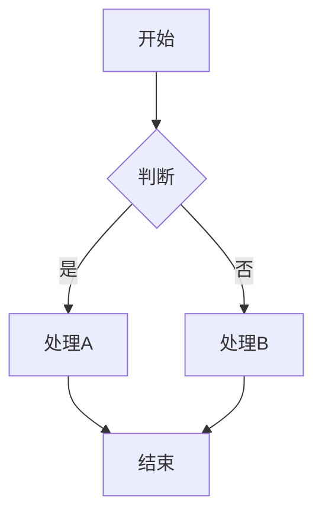
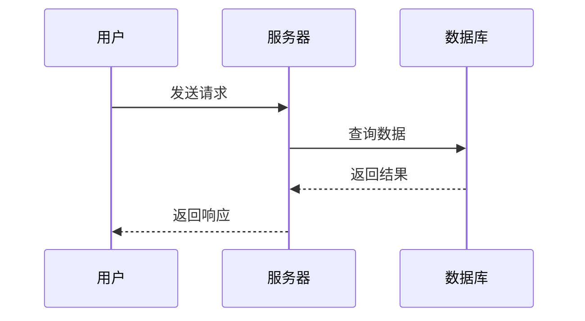
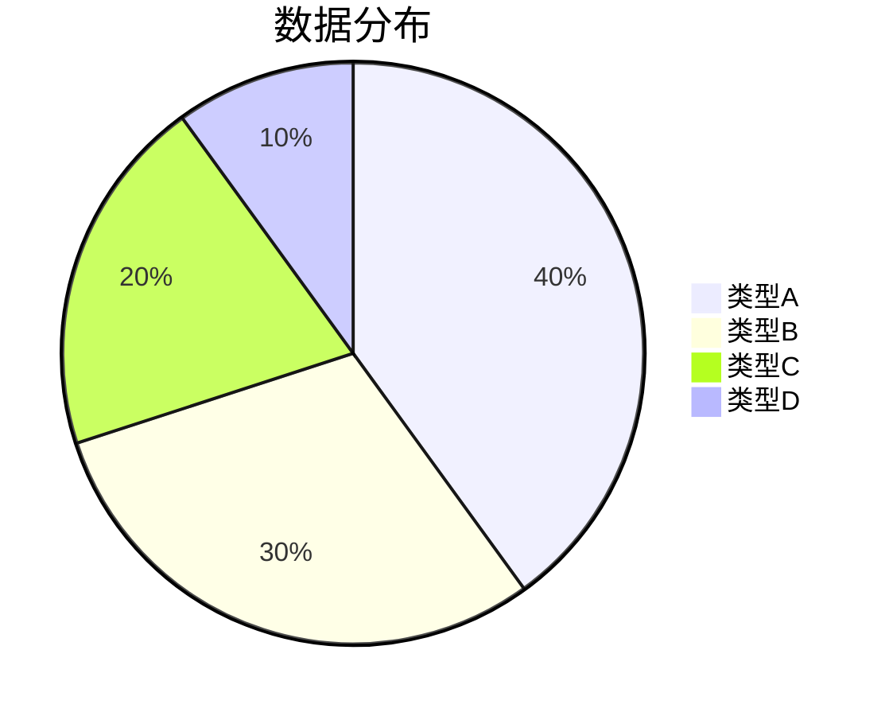
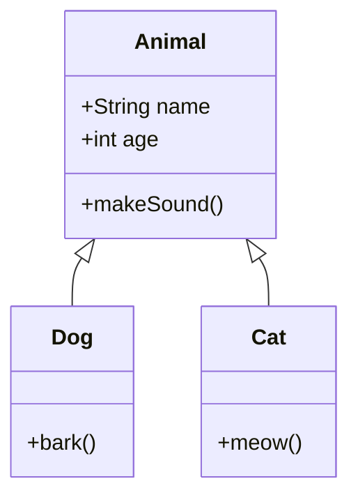
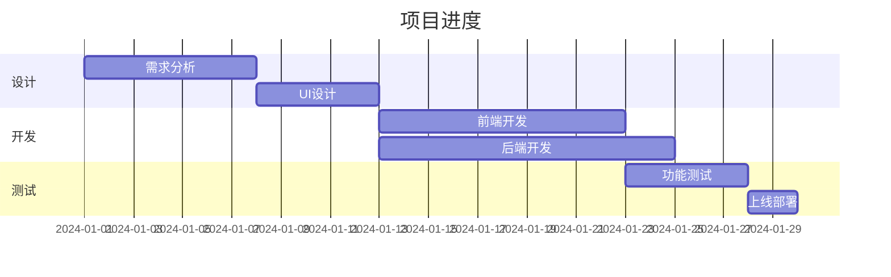

# Mermaider - Mermaid 图表编辑器

一个基于 C# Avalonia 构建的本地 Mermaid 图表编辑器，支持实时预览、语法检测和图片导出。

## 功能特性

### 核心功能
- **代码编辑** - 编辑 Mermaid 代码，支持语法高亮和行号显示
- **实时预览** - 编辑代码时自动更新图表预览（基于 WebView + Mermaid.js）
- **语法检测** - 实时检测 Mermaid 语法错误并提示
- **语法高亮** - 支持 Mermaid 语法高亮显示
- **多标签页** - 支持多标签页编辑 Mermaid 代码和展示，各标签页独立
- **智能防抖渲染** - 输入后自动延迟渲染（350ms），避免频繁刷新
- **复制图片** - 将图表复制到剪贴板（高清，3倍缩放）
- **保存图片** - 支持多种格式导出
  - PNG 图片（高清，3倍缩放）
  - JPEG 图片（高清，3倍缩放）

### AI 助手
- **智能对话** - 内置 AI 助手，支持自然语言生成 Mermaid 图表代码
- **多模型支持** - 支持多种 AI 服务提供商
  - OpenAI (GPT-4o 等)
  - Azure OpenAI
  - Ollama (本地部署)
  - 自定义 API 端点
- **代码应用** - 一键将 AI 生成的代码应用到编辑器
- **对话历史** - 保留对话上下文，支持连续交互
- **可配置参数** - 支持调整 Temperature、MaxTokens 等参数
  
### 预览交互
- **拖拽平移** - 在预览区按住鼠标左键拖拽移动图表
- **滚轮缩放** - 在预览区使用鼠标滚轮缩放图表
- **双击适应** - 双击预览区自动适应视口大小
- **编辑器切换** - 点击分隔条中的切换按钮可隐藏/显示编辑器，获得全屏预览

### 文件操作
- 新建 / 打开 / 保存 Mermaid 文件（.mmd / .mermaid）
- 支持命令行参数打开文件
- 最近文件记录（最多10个）
- 关闭未保存标签时弹出保存确认对话框
- 关闭程序时检测未保存修改，提示保存
- 重复打开同一文件时自动切换到已有标签页

### 界面特性
- 可调整编辑器与预览区分隔比例（拖拽分隔条）
- 分隔条内置切换按钮，便于隐藏/显示编辑器
- AI 助手面板可展开/折叠，高度可调整
- 现代化 Fluent 主题界面
- 自动保存窗口布局设置（编辑器比例、缩放级别等）
- 崩溃日志自动记录

## 技术栈

- **语言**: C# (.NET 10)
- **UI 框架**: Avalonia UI 11.3
- **架构模式**: MVVM (CommunityToolkit.Mvvm)
- **代码编辑器**: AvaloniaEdit
- **预览渲染**: Mermaid.js（通过 WebView 实时渲染）
- **图片导出**: Mermaid CLI 11.12.0（嵌入式，用于高清图片导出）
- **WebView**: WebView.Avalonia

## 环境要求

### 开发环境
- .NET 10 SDK
- Avalonia 模板

### 运行打包版本
- Windows 系统（需内置 WebView2 运行时，Windows 10/11 已预装）
- 无需安装 Node.js 或其他依赖，Self-Contained 双击即可运行

## 构建项目

### 开发模式

```bash
dotnet restore
dotnet run
```

命令行参数打开文件：

```bash
dotnet run -- example.mmd
```

### 发布 Self-Contained 版本

使用项目自带的发布脚本：

```powershell
.\publish.ps1
```

或手动执行：

```bash
dotnet publish -c Release -r win-x64 --self-contained true -p:PublishSingleFile=true
```

> 提示：Mermaid CLI 工具已作为嵌入式资源打包，无需额外复制 `tools` 目录。

## 使用说明

### 打开文件

- 菜单栏：文件 → 打开（Ctrl+O）
- 命令行参数：`Mermaider.exe example.mmd`
- 最近文件：文件 → 最近文件

支持 .mmd 和 .mermaid 扩展名。

### 编辑代码

在左侧代码编辑器中输入或修改 Mermaid 代码，右侧预览区会实时更新图表。

### 保存文件

- 保存：文件 → 保存（Ctrl+S）
- 另存为：文件 → 另存为（Ctrl+Shift+S）

### 导出图片

- 点击预览区右上角的"保存"按钮保存图片文件
- 点击预览区右上角的"复制"按钮复制图片到剪贴板

### 预览操作

- **拖拽平移**：在预览区按住鼠标左键拖拽
- **缩放**：在预览区使用鼠标滚轮（向上放大，向下缩小）
- **双击适应**：双击预览区自动适应视口
- **隐藏/显示编辑器**：点击编辑器与预览区之间分隔条中的切换按钮

### AI 助手

1. 点击底部的"AI 助手"按钮展开面板
2. 在输入框中描述你想要的图表（如"画一个用户登录流程图"）
3. AI 会生成对应的 Mermaid 代码
4. 点击"应用代码"将生成的代码插入编辑器
5. 点击设置图标可配置 AI 模型参数

## 示例代码

### 流程图



### 时序图



### 饼图



### 类图



### 甘特图



## 快捷键

| 快捷键 | 功能 |
|--------|------|
| Ctrl+N | 新建文件 |
| Ctrl+O | 打开文件 |
| Ctrl+S | 保存文件 |
| Ctrl+Shift+S | 另存为 |
| Ctrl+W | 关闭当前标签 |
| Ctrl+Q | 退出程序 |
| Ctrl+Z | 撤销 |
| Ctrl+Y / Ctrl+Shift+Z | 重做 |
| Ctrl+X | 剪切 |
| Ctrl+C | 复制 |
| Ctrl+V | 粘贴 |
| Ctrl+A | 全选 |

## 许可证

本项目采用 Apache License 2.0 许可证。详见 [LICENSE](LICENSE) 文件。

## 致谢

本项目使用了以下开源项目：

- [Avalonia UI](https://avaloniaui.net/) - 跨平台 UI 框架
- [AvaloniaEdit](https://github.com/AvaloniaUI/AvaloniaEdit) - 代码编辑器控件
- [Mermaid.js](https://mermaid.js.org/) - Mermaid 图表渲染引擎（预览）
- [Mermaid CLI](https://github.com/mermaid-js/mermaid-cli) - Mermaid 图表渲染引擎（导出）
- [WebView.Avalonia](https://github.com/AvaloniaUI/AvaloniaWebView) - WebView 控件
- [CommunityToolkit.Mvvm](https://learn.microsoft.com/dotnet/communitytoolkit/mvvm/) - MVVM 工具包
