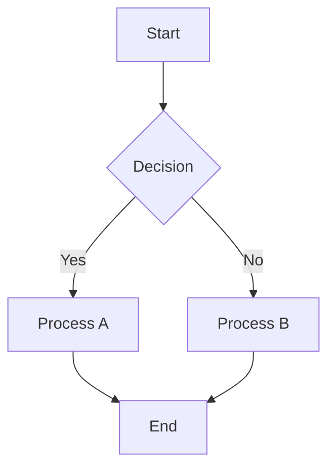
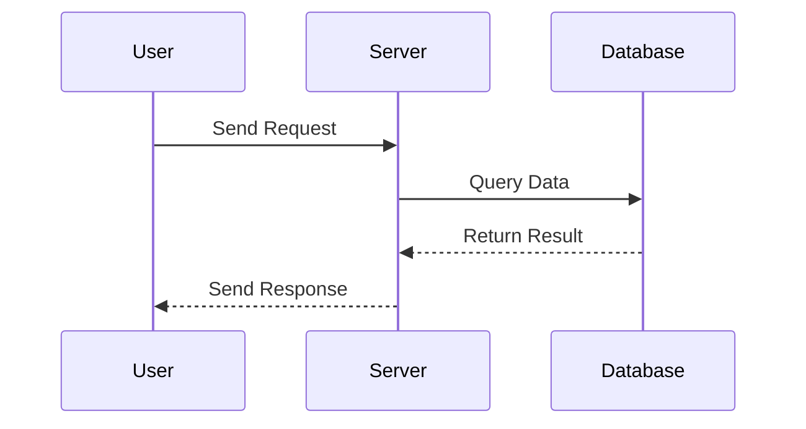
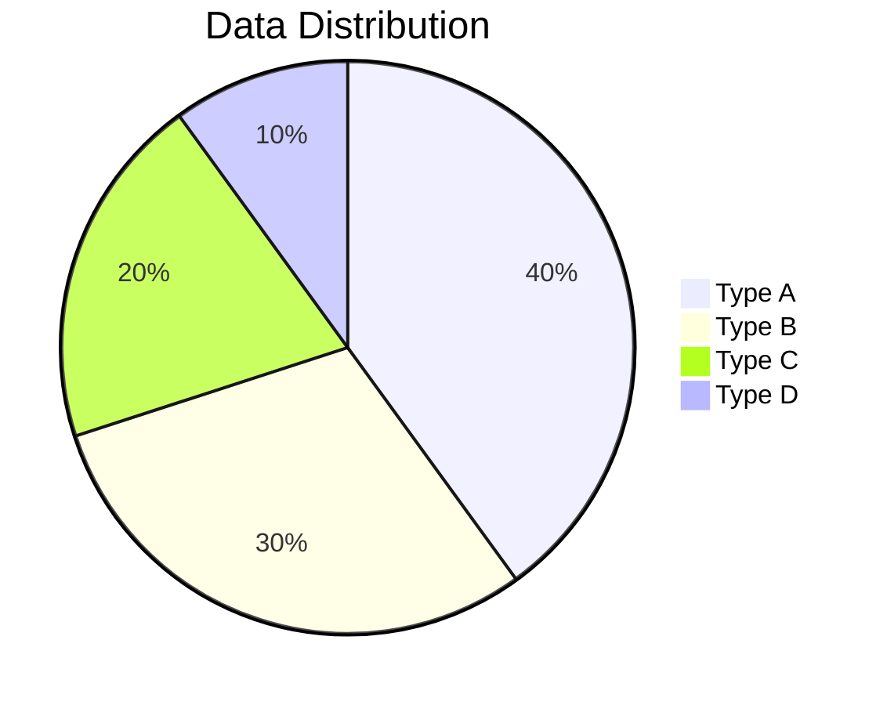
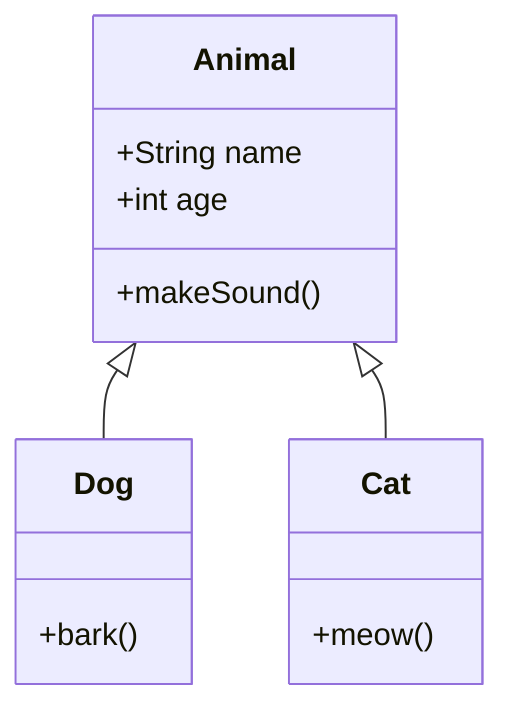
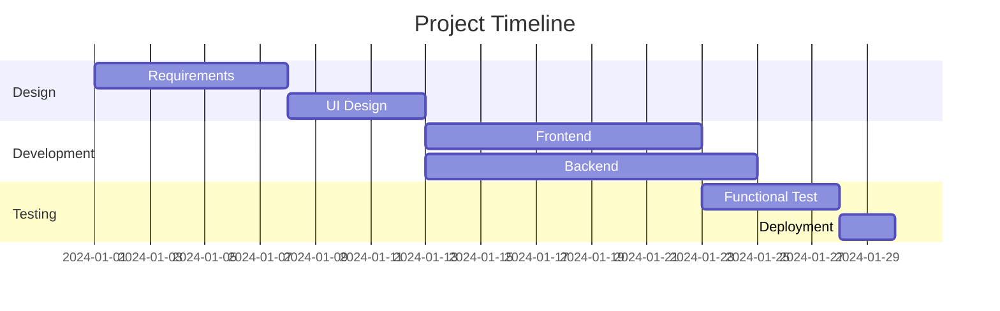

# Mermaider - Mermaid Diagram Editor

A local Mermaid diagram editor built with C# Avalonia, featuring real-time preview and syntax validation.

## Features

### Core Features
- **Code Editing** - Edit Mermaid code with ease
- **Real-time Preview** - Automatic diagram preview updates while editing
- **Syntax Validation** - Real-time Mermaid syntax error detection and feedback
- **Syntax Highlighting** - Mermaid syntax highlighting support
- **Multi-tab Support** - Edit multiple Mermaid diagrams with independent tabs

### File Operations
- Create / Open / Save Mermaid files (.mmd / .mermaid)
- Command-line argument support for opening files
- Recent files history (up to 10 files)

### Export Features
- **Copy Image** - Copy diagram to clipboard (high resolution, 3x scale)
- **Save Image** - Export in multiple formats
  - PNG image (high resolution, 3x scale)
  - JPEG image (high resolution, 3x scale)

### UI Features
- Zoomable preview (Ctrl + mouse wheel)
- Resizable editor/preview splitter
- Modern Fluent theme interface
- Auto-save window layout settings

## Tech Stack

- **Language**: C# (.NET 10)
- **UI Framework**: Avalonia UI 11.3
- **Architecture**: MVVM (CommunityToolkit.Mvvm)
- **Code Editor**: AvaloniaEdit
- **Diagram Rendering**: Mermaid CLI 11.12.0 (embedded)

## Requirements

### Development Environment
- .NET 10 SDK
- Avalonia templates

### Running Packaged Version
- No dependencies required, self-contained executable

## Building

### Development Mode

```bash
dotnet restore
dotnet run
```

Open file via command line:

```bash
dotnet run -- example.mmd
```

### Publish Self-Contained Version

```bash
dotnet publish -c Release -r win-x64 --self-contained true -p:PublishSingleFile=true
```

After publishing, copy the `tools` directory to the output folder.

## Usage

### Opening Files

- Menu: File → Open (Ctrl+O)
- Command line: `Mermaider.exe example.mmd`
- Recent files: File → Recent Files

Supports .mmd and .mermaid extensions.

### Editing Code

Enter or modify Mermaid code in the left editor panel. The right preview area updates automatically.

### Saving Files

- Save: File → Save (Ctrl+S)
- Save As: File → Save As (Ctrl+Shift+S)

### Exporting Images

- Click the "Copy" button in the preview area to copy image to clipboard
- Click the "Save" button in the preview area to save image file

### Preview Controls

- **Zoom**: Ctrl + mouse wheel up to zoom in, down to zoom out
- **Reset**: View → Reset Zoom (Ctrl+0)

## Example Code

### Flowchart



### Sequence Diagram



### Pie Chart



### Class Diagram



### Gantt Chart



## Keyboard Shortcuts

| Shortcut | Action |
|----------|--------|
| Ctrl+N | New File |
| Ctrl+O | Open File |
| Ctrl+S | Save File |
| Ctrl+Shift+S | Save As |
| Ctrl+W | Close Current Tab |
| Ctrl+Q | Exit |
| Ctrl+Z | Undo |
| Ctrl+Y | Redo |
| Ctrl+X | Cut |
| Ctrl+C | Copy |
| Ctrl+V | Paste |
| Ctrl+A | Select All |
| Ctrl++ | Zoom In Preview |
| Ctrl+- | Zoom Out Preview |
| Ctrl+0 | Reset Zoom |

## License

This project is licensed under the Apache License 2.0. See [LICENSE](LICENSE) file for details.

## Acknowledgments

This project uses the following open-source projects:

- [Avalonia UI](https://avaloniaui.net/) - Cross-platform UI framework
- [AvaloniaEdit](https://github.com/AvaloniaUI/AvaloniaEdit) - Code editor control
- [Mermaid CLI](https://github.com/mermaid-js/mermaid-cli) - Mermaid diagram rendering engine
- [CommunityToolkit.Mvvm](https://learn.microsoft.com/dotnet/communitytoolkit/mvvm/) - MVVM toolkit
